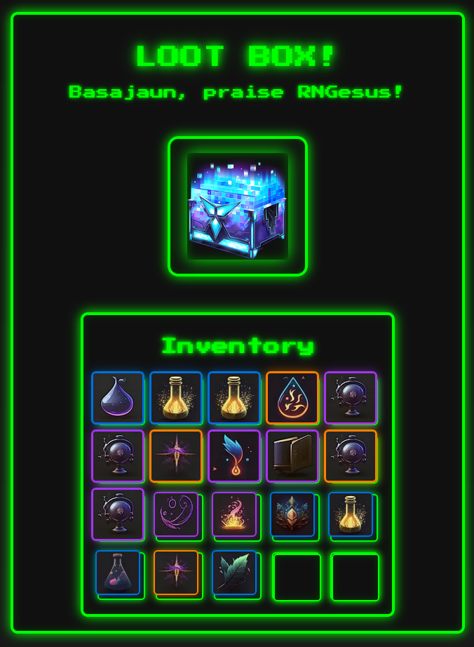
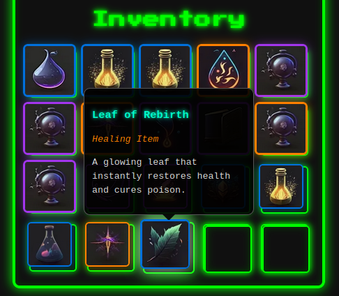

# Loot-box
<p align="center">
  
</p>

This is just a `mini toy project` inspired by **retro video games** and developed to practice concepts from the **Web Systems course** (Computer Science degree, UPV/EHU), in preparation for the exam.
. It's a simple lootbox system where you can open a chest, reveal random items, and add them to their inventory. Because I am a bit of a nerd, I've added some **lore** as a minor touch for each item's background, in a form of `tooltips`:

<p align="center">
  
</p>

---

## How it works and features

- Click the chest to reveal a random item.
- Click revealed items to your inventory.
- Admins can add new items to the lootbox pool.
- Reset your inventory anytime.

---

## Technologies used

I've used a  small combination of tools and libraries:

- **Node.js**
- **Express** for backend's API.
- **MongoDB + Mongoose**: Database and ODM.
- **Multer**: File upload handling.
- **Bcrypt**: Password hashing for secure auth.


## Try it

- Web app: [Loot-box](https://loot-box.up.railway.app/) (it uses free cloud hosting so it might be a bit slow)
- `Docker` image: [Docker Hub](https://hub.docker.com/repository/docker/basajaun0/loot-box/general)

---


## Setup

1. Clone the repository.
2. Install dependencies:
   ```bash
   npm install
   ```
3. Start the server:
   ```bash
   npm start
   ```
4. Visit the app in your browser.

---

Enjoy it!
